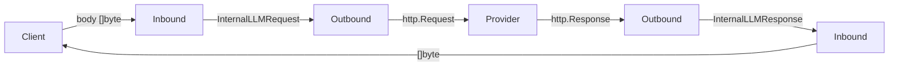

# Transformer Canonical Rewrite Plan

## 1. Problem

The current `InternalLLMRequest` / `InternalLLMResponse` in `[internal/transformer/model/model.go](internal/transformer/model/model.go)` is heavily OpenAI-biased (1100+ lines), mixing provider-specific concerns (Anthropic CacheControl, Gemini types) with the "internal" representation. Adding providers requires touching the shared model.

## 2. Strategy: Parallel Package (`transformer2`)

Instead of modifying the existing `internal/transformer` in-place, we create a brand-new `internal/transformer2` package alongside it. This gives us:

- **Zero regression risk**: the old code keeps running until the new package is fully tested.
- **Incremental switchover**: relay and other callers can be migrated one call-site at a time.
- **Easy rollback**: if anything goes wrong, revert the import path change; no code was deleted.

The switchover happens in two steps:
1. Build and test `internal/transformer2` (Phases 1–2).
2. Update all imports in `internal/relay`, `internal/server`, `internal/helper`, `internal/model` from `internal/transformer` to `internal/transformer2` (Phase 3).
3. Delete the old `internal/transformer` directory (Phase 4).

## 3. Current Architecture (unchanged — `internal/transformer`)



Key files (remain untouched until Phase 3):

- `[internal/transformer/model/interface.go](internal/transformer/model/interface.go)` - `Inbound` / `Outbound` interfaces
- `[internal/transformer/model/model.go](internal/transformer/model/model.go)` - 1120-line monolith with all types
- `[internal/transformer/model/gemini.go](internal/transformer/model/gemini.go)` - Gemini types leaked into shared model
- `[internal/transformer/inbound/register.go](internal/transformer/inbound/register.go)` - factory registry
- `[internal/transformer/outbound/register.go](internal/transformer/outbound/register.go)` - factory registry + channel type helpers

## 4. New Directory Structure (`internal/transformer2`)

```
internal/transformer2/
├── canonical/                     # Provider-agnostic intermediate types
│   ├── request.go                 # Request, RequestKind, TransformHints
│   ├── response.go                # Response, Chunk, Choice
│   ├── message.go                 # Message, ContentBlock, Role
│   ├── tool.go                    # Tool, ToolCall, ToolChoice, ImageGenerationConfig
│   ├── media.go                   # ImageContent, AudioContent, FileContent
│   └── usage.go                   # Usage, TokenDetails
├── adapter/
│   ├── adapter.go                 # ClientAdapter / ProviderAdapter interfaces
│   ├── registry.go                # Factory + channel type helpers (DB-compat iota values)
│   ├── aggregator.go              # StreamAggregator (extracted from inbound state)
│   ├── openai/
│   │   ├── types_chat.go          # OpenAI Chat wire types (ChatCompletionRequest, etc.)
│   │   ├── types_responses.go     # OpenAI Responses wire types (ResponsesRequest, etc.)
│   │   ├── types_embedding.go     # OpenAI Embedding wire types
│   │   ├── client_chat.go         # ClientAdapter for /v1/chat/completions
│   │   ├── client_responses.go    # ClientAdapter for /v1/responses (stateful streaming)
│   │   ├── client_embedding.go    # ClientAdapter for /v1/embeddings
│   │   ├── provider_chat.go       # ProviderAdapter for OpenAI-compat Chat backends
│   │   ├── provider_responses.go  # ProviderAdapter for OpenAI-compat Responses backends
│   │   ├── provider_embedding.go  # ProviderAdapter for embedding backends
│   │   ├── convert.go             # Shared OpenAI <-> Canonical helpers
│   │   └── quirks/                # Provider-specific API deviations (auto-loaded via init)
│   │       ├── quirks.go          # Registry and Interceptor interfaces
│   │       ├── cerebras.go        # e.g., strips unsupported metadata field
│   │       └── groq.go            # e.g., Groq-specific adjustments
│   ├── anthropic/
│   │   ├── types.go               # Anthropic wire types (MessageRequest, etc.)
│   │   ├── client.go              # ClientAdapter for /v1/messages
│   │   ├── provider.go            # ProviderAdapter for Anthropic backends
│   │   └── convert.go             # Anthropic <-> Canonical helpers
│   ├── gemini/
│   │   ├── types.go               # Gemini wire types (moved from model/gemini.go)
│   │   ├── provider.go            # ProviderAdapter for Gemini backends
│   │   └── convert.go             # Gemini <-> Canonical helpers
│   └── volcengine/
│       └── provider_responses.go  # ProviderAdapter wrapping OpenAI Responses provider
```


## Detailed Design Documents

- [Canonical Package Design](canonical.md)
- [Adapter Interfaces](interfaces.md)
- [OpenAI Adapters](openai.md)
- [Anthropic Adapter](anthropic.md)
- [Gemini Adapter](gemini.md)
- [Cross-Cutting Conversion Matrix](cross_cutting.md)

## 8. Relay Integration Changes (Phase 3)

`[internal/relay/relay.go](internal/relay/relay.go)` — change import paths from `internal/transformer/{inbound,outbound,model}` to `internal/transformer2/{adapter,canonical}`, swap type names and adjust call signatures:


| Current                           | New                                  | Notes |
| --------------------------------- | ------------------------------------ | ----- |
| `model.Inbound`                   | `adapter.ClientAdapter`              | import `internal/transformer2/adapter` |
| `model.Outbound`                  | `adapter.ProviderAdapter`            | |
| `model.InternalLLMRequest`        | `canonical.Request`                  | import `internal/transformer2/canonical` |
| `model.InternalLLMResponse`       | `canonical.Response`                 | |
| `inbound.Get(type)`               | `adapter.GetClient(type)`            | |
| `outbound.Get(type)`              | `adapter.GetProvider(type)`          | |
| `inAdapter.TransformRequest(ctx, body)` | `clientAdapter.ParseRequest(ctx, body, c.Request.Header)` | **adds header param** |
| `outAdapter.TransformRequest()`   | `providerAdapter.BuildRequest()`     | |
| `outAdapter.TransformResponse()`  | `providerAdapter.ParseResponse()`    | |
| `inAdapter.TransformResponse()`   | `clientAdapter.FormatResponse()`     | |
| `outAdapter.TransformStream()`    | `providerAdapter.ParseStreamChunk()` | |
| `inAdapter.TransformStream()`     | `clientAdapter.FormatStreamChunk()`  | |
| `inAdapter.GetInternalResponse()` | `clientAdapter.AggregateStream()`    | |
| `resp.Object == "[DONE]"`         | `chunk.Done == true`                 | stream termination signal |
| *(error: return raw)*             | `clientAdapter.FormatError(ctx, &canonical.Error{...})` | **new error path** |

### 8.1 Error Handling Flow Change

Current relay returns errors directly. New flow:
1. `ProviderAdapter.ParseResponse` or proxy logic produces `canonical.Error`
2. Relay calls `clientAdapter.FormatError(ctx, err)` to serialize in client format
3. Relay writes the formatted bytes to `c.Writer`

This ensures Claude Code (Anthropic client) always gets Anthropic-shaped errors even when the backend is OpenAI, and vice versa.

### 8.2 Stream Termination

Current: relay checks `stream.Object == "[DONE]"` to break out of the SSE loop.
New: `canonical.Chunk.Done bool` — set to `true` by provider adapter on stream end (OpenAI `[DONE]`, Anthropic `message_stop`, Gemini connection close).

### 8.3 All External Callers to Update

| File | Current Import | Change Required |
| ---- | -------------- | --------------- |
| `internal/relay/relay.go` | `transformer/inbound`, `transformer/outbound`, `transformer/model` | Replace with `transformer2/adapter`, `transformer2/canonical` |
| `internal/relay/type.go` | `transformer/model` | Replace with `transformer2/canonical`, `transformer2/adapter`; struct fields → `canonical.Request`, `canonical.Response`, `adapter.ClientAdapter`, `adapter.ProviderAdapter` |
| `internal/relay/metrics.go` | `transformer/model` (aliased) | Replace with `transformer2/canonical`; deep field access migration (see §8.4) |
| `internal/server/handlers/relay.go` | `transformer/inbound` (type constants) | Replace with `transformer2/adapter`; `inbound.InboundTypeOpenAIChat` → `adapter.ClientOpenAIChat`, etc. |
| `internal/helper/fetch.go` | `transformer/outbound` (type constants) | Replace with `transformer2/adapter`; `outbound.OutboundTypeAnthropic` → `adapter.ProviderAnthropic`, etc. |
| `internal/model/channel.go` | `transformer/outbound` (type for DB field) | Replace with `transformer2/adapter`; `outbound.OutboundType` → `adapter.ProviderType` (see §8.5) |

### 8.4 metrics.go Field Access Migration

`metrics.go` deeply accesses internal model types. Key changes:

| Current Access | New Access |
| --- | --- |
| `msg.Content.Content` (`*string`) | `msg.Content[0].Text` (`string`, check `len > 0`) |
| `msg.Content.MultipleContent` (`[]MessageContentPart`) | `msg.Content` (`[]ContentBlock`) |
| `part.Type == "text" && part.Text != nil` | `block.Type == ContentText` |
| `part.ImageURL` | `block.Media` (when `block.Type == ContentImage`) |
| `choice.Message` (`*Message`) | `choice.Message` (`Message`, value type) |
| `choice.Delta` (`*Message`) | N/A in `Response`; only in `Chunk.Deltas[].Delta` |
| `resp.Usage.AnthropicUsage` (`bool`) | `resp.Usage.IsAnthropicUsage` (`bool`) |
| `resp.Usage.CacheCreationInputTokens` | `resp.Usage.CacheCreationInputTokens` (same) |
| `resp.Usage.PromptTokensDetails.CachedTokens` | `resp.Usage.PromptTokensDetails.CachedTokens` (same) |
| `msg.Audio.Data` | `block.Media.AudioData` (when `block.Type == ContentAudio`) |
| `msg.Images` | `msg.Images` (same) |

`filterResponseForLog` must be rewritten to traverse `[]ContentBlock` and filter by `ContentType`.

### 8.5 Database Type Backward Compatibility

`Channel.Type` (`outbound.OutboundType`) is persisted to the database. The new `transformer2/adapter.ProviderType` **MUST** use identical `iota` values:

```
0 = ProviderOpenAIChat      (was OutboundTypeOpenAIChat)
1 = ProviderOpenAIResponse   (was OutboundTypeOpenAIResponse)
2 = ProviderAnthropic        (was OutboundTypeAnthropic)
3 = ProviderGemini           (was OutboundTypeGemini)
4 = ProviderVolcengine       (was OutboundTypeVolcengine)
5 = ProviderOpenAIEmbedding  (was OutboundTypeOpenAIEmbedding)
```

Option A: Define `adapter.ProviderType` with explicit values matching the old enum.
Option B: Keep `outbound.OutboundType` as a type alias in the new registry for DB compat.

Either way, this must not break existing database rows.

## 9. Migration Strategy (Phased — Parallel Package Approach)

> **Core principle**: `internal/transformer` is never modified. All new code goes into `internal/transformer2`. The old package is only removed after the swap is verified.

**Phase 1: Create `internal/transformer2` skeleton**

- Create `transformer2/canonical/` package (request.go, response.go, message.go, tool.go, media.go, usage.go)
- Create `transformer2/adapter/adapter.go` (interfaces) + `registry.go` + `aggregator.go`
- Ensure `ProviderType` iota values match existing `outbound.OutboundType` (DB compat)
- `internal/transformer` remains untouched; the application still uses it

**Phase 2: Implement adapters in `internal/transformer2` (order by priority)**

1. OpenAI Chat — most common, reference implementation
  - Non-streaming request/response first
  - Then streaming (SSE with `[DONE]` → `Chunk.Done`)
  - Then tool calls, media, reasoning
  - Then usage with `stream_options.include_usage`
2. OpenAI Responses API — production-critical for `/v1/responses` endpoint
  - Client: stateful streaming event mapping (~900 lines: `response.created`, `response.output_text.delta`, `response.function_call_arguments.delta`, `response.completed`, etc.)
  - Client: `input` format handling (string vs items array via `TransformHints.ResponsesArrayInput`)
  - Client: `include` field preservation via `TransformHints.Include`
  - Client: image_generation tool type + image_generation_call response handling
  - Provider: `ConvertToResponsesRequest` converting canonical → Responses wire format
  - Provider: instructions extraction from system/developer messages
3. Anthropic — second most common
  - Core message conversion with system extraction
  - Streaming (event-based: `message_start`, `content_block_delta`, etc.)
  - Tool use blocks + tool result blocks
  - Thinking/reasoning with signature passthrough
  - CacheControl passthrough
4. Gemini — provider-only
  - Content/Parts conversion with role mapping
  - Tool/FunctionDeclaration conversion (args map<->JSON)
  - ThinkingConfig + thought signature
  - URL path construction
5. Volcengine — wrapper around OpenAI **Responses** API provider (NOT Chat)
  - Custom `Thinking` struct (type: auto/disabled/enabled)
  - Strips unsupported metadata
  - Filters `reasoning_effort` by supported model list

Each adapter: unit tests with real JSON fixtures from official docs. Tests can run independently — they don't touch the old `internal/transformer` at all.

**Phase 3: Swap references — wire `transformer2` into relay and other callers**

This is the "big switch" phase. Change import paths across the codebase:

- `internal/relay/relay.go`: replace `transformer/inbound`, `transformer/outbound`, `transformer/model` imports with `transformer2/adapter`, `transformer2/canonical`
- `internal/relay/type.go`: replace struct field types
- `internal/relay/metrics.go`: replace field access patterns (see §8.4)
- `internal/server/handlers/relay.go`: replace `transformer/inbound` with `transformer2/adapter` type constants
- `internal/helper/fetch.go`: replace `transformer/outbound` with `transformer2/adapter` type constants
- `internal/model/channel.go`: replace `outbound.OutboundType` with `adapter.ProviderType` (DB compat, see §8.5)
- Pass `c.Request.Header` to `ParseRequest` (new param)
- Add `FormatError` error handling path
- Replace `resp.Object == "[DONE]"` with `chunk.Done`
- Run integration tests end-to-end
- Verify: streaming, tool calls, media, reasoning, usage for each combination

**Phase 4: Remove old `internal/transformer`**

- Delete the entire `internal/transformer/` directory (model/, inbound/, outbound/)
- Verify no remaining imports reference `internal/transformer` (only `internal/transformer2`)
- Remove any dead helper code that only served the old types

